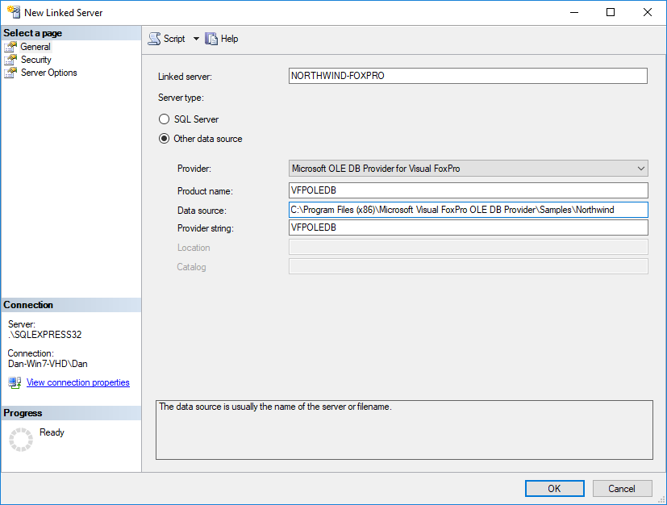

# Visual FoxPro on Windows 10

1. Install a **new** named instance of the [**32-bit version** of SQL Express](https://www.microsoft.com/en-au/download/details.aspx?id=29062) - `SQLEXPR32_x86_ENU.exe` - (even if you already have MSSQL installed)
1. Install the [OLE Db Provider for Visual FoxPro 9.0](https://www.microsoft.com/en-us/download/details.aspx?id=14839). Include the samples, so that you can check it out in later steps.
1. Connect to the 32-bit SQL server in Microsoft SQL Management Server.
1. In the Object Explorer, expand *Server Objects > Linked Servers > Providers* and ensure that the **VPOLEDB** provider is installed.
1. Right-click the **VPOLEDB** provider and choose *Properties*. Ensure that the *Allow inprocess* option is turned on.
  
1. Add a new linked server by right-clicking **Linked Servers** and choosing *New Linked Server...*. For the sample database, you can use the *Northwind* sample installed with the OLE Db Provider for Visual FoxPro (step 2 above): `C:\Program Files (x86)\Microsoft Visual FoxPro OLE DB Provider\Samples\Northwind`
  

Now you can access the database in MSSQL Management Studio to query the tables.

> Note: When checking out the sample tables, try doing the *customers* table; the *categories* table seems to return an error on my system.
